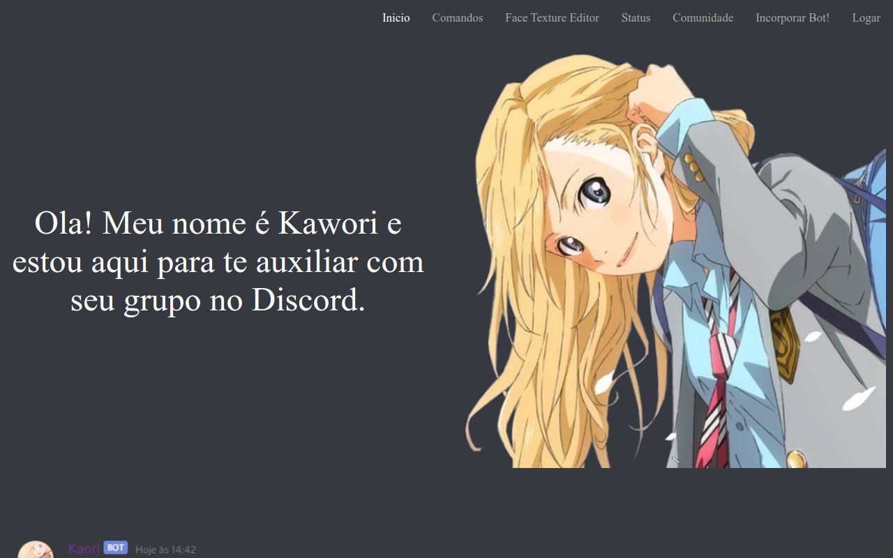

# Kawori-Site

> Front end que consome a API do bot Kawori do repositorio https://github.com/ghpm99/kawori.
Utiliza NextJs com Styled-componentes e Next-auth.

### Ajustes e melhorias

O projeto ainda está em desenvolvimento e as próximas atualizações serão voltadas nas seguintes tarefas:

- [x] Implementação de authenticação atraves de API Key
- [ ] Implementação de edição da janela de grupos/painel interno

## 💻 Pré-requisitos

Antes de começar, verifique se você atendeu aos seguintes requisitos:
* Você instalou a versão mais recente de `<NextJs / Styled-componentes / next-auth>`
* Você tem uma máquina `<Windows>`.

[⬆ Voltar ao topo](#nome-do-projeto) 

